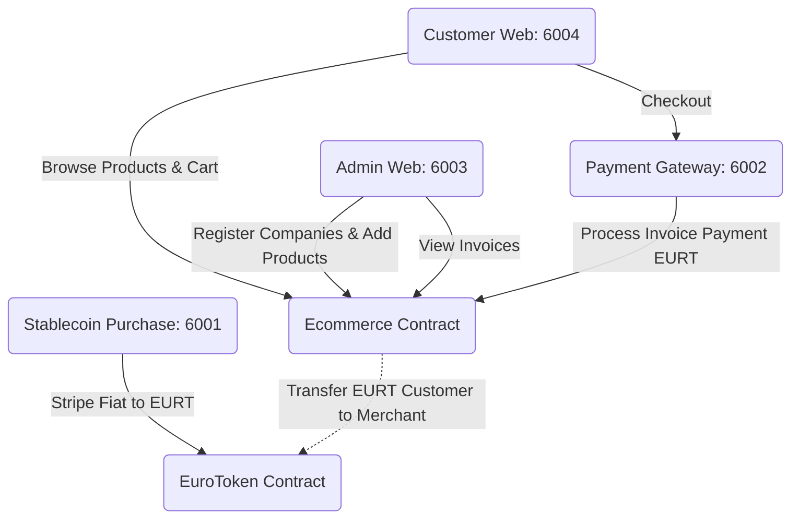

# Blockchain E-Commerce Ecosystem

Welcome to the comprehensive Web3 E-Commerce platform. This ecosystem brings together smart contract-based transaction handling, merchant administration, customer storefronts, a payment gateway, and a stablecoin acquisition service to create a seamless crypto-shopping experience.

## Watch the full Demo

- **Peter-Dubin_Ethereum-practice_Ecommerce**: https://drive.google.com/file/d/1vKo82yO8E9vaxd6GHlk8BPnYjpSx9Lyb/view?usp=sharing

## System Architecture

The project is structured into smart contract environments and specific frontend services.



## Quick Start (Local Development)

The easiest way to start up the entire ecosystem on your local machine is to run our master shell script. This script automatically spins up the local memory blockchain (`anvil`), deploys both smart contracts natively, handles environment variables propagation, and starts all `Next.js` servers.

### Prerequisites
- Node.js (v20)
- `foundry` stack (`forge`, `cast`, `anvil`)

### Run the ecosystem
From the root of the repository, execute:
```bash
./restart-all.sh
```

### Services Available
Once the script has finished its setup, it will maintain the processes open. You can access the following services:

| Application | Address / Port | Role |
|---|---|---|
| **Stablecoin Purchase** | `http://localhost:6001` | Allows users to buy EURT using fiat limits via Stripe. |
| **Payment Gateway**     | `http://localhost:6002` | Handles direct EURT invoice settlements. |
| **Merchant Admin**      | `http://localhost:6003` | Admin dashboard to register stores and upload products. |
| **Customer Storefront** | `http://localhost:6004` | Market where users browse, build a cart, and execute checkout. |

## Subprojects Directory

- `stablecoin/sc`: Foundry project containing the ERC20 Stablecoin (`EuroToken.sol`).
- `stablecoin/compra-stablecoin`: Next.js frontend bridging Stripe and Smart Contracts to emit tokenized EUR.
- `stablecoin/pasarela-de-pago`: Next.js dedicated checkout module bridging merchants and invoices.
- `sc-ecommerce`: Foundry project housing the `Ecommerce.sol` master logic.
- `web-admin`: Next.js storefront for Merchants.
- `web-customer`: Next.js marketplace for Buyers.
- `docs/`: Comprehensive project documentation.
