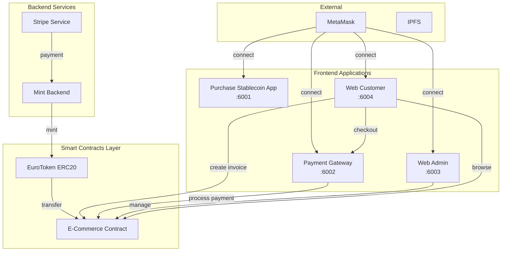

# Blockchain E-Commerce Project Plan

## Project Overview

This project implements a complete blockchain-based e-commerce system using Ethereum, stablecoins, and traditional payment integrations. The system consists of 6 main components working together to enable seamless online shopping with cryptocurrency.



## Architecture Summary

| Component | Location | Port | Technology |
|-----------|----------|------|------------|
| EuroToken | `stablecoin/sc/` | N/A | Solidity + Foundry |
| Purchase App | `stablecoin/compra-stableboin/` | 6001 | Next.js 15 + Stripe |
| Payment Gateway | `stablecoin/pasarela-de-pago/` | 6002 | Next.js 15 |
| E-commerce SC | `sc-ecommerce/` | N/A | Solidity + Foundry |
| Web Admin | `web-admin/` | 6003 | Next.js 15 |
| Web Customer | `web-customer/` | 6004 | Next.js 15 |

---

## Phase 1: Environment Setup

### 1.1 Prerequisites Installation

```bash
# Install Foundry (if not installed)
curl -L https://foundry.paradigm.xyz | bash
foundryup

# Install Node.js 18+ (if not installed)
# https://nodejs.org/

# Install MetaMask browser extension
# https://metamask.io/download/
```

### 1.2 Project Structure Creation

```
e_commerce/
├── stablecoin/
│   ├── sc/                      # EuroToken contract
│   ├── compra-stablecoin/       # Buy tokens with Stripe
│   └── pasarela-de-pago/        # Payment gateway
├── sc-ecommerce/                # E-commerce contract
├── web-admin/                   # Admin panel
└── web-customer/                # Customer store
```

### 1.3 Anvil & MetaMask Configuration

```bash
# Start Anvil with test accounts
anvil --accounts 10 --chain-id 31337

# MetaMask Configuration
# Network Name: Localhost 8545
# RPC URL: http://localhost:8545
# Chain ID: 31337
# Currency Symbol: ETH
```

---

## Phase 2: EuroToken Smart Contract

### 2.1 Contract Implementation

**File**: `stablecoin/sc/src/EuroToken.sol`

```solidity
// SPDX-License-Identifier: MIT
pragma solidity ^0.8.20;

import {ERC20} from "@openzeppelin/contracts/token/ERC20/ERC20.sol";
import {Ownable} from "@openzeppelin/contracts/access/Ownable.sol";

contract EuroToken is ERC20, Ownable {
    uint256 public constant INITIAL_SUPPLY = 1_000_000 * 10**6;
    
    event TokensMinted(address indexed to, uint256 amount);
    event TokensBurned(address indexed from, uint256 amount);

    constructor(address initialOwner) 
        ERC20("EuroToken", "EURT") 
        Ownable(initialOwner) 
    {
        _mint(msg.sender, INITIAL_SUPPLY);
    }

    function decimals() public pure override returns (uint8) {
        return 6;  // cents
    }

    function mint(address to, uint256 amount) external onlyOwner {
        require(to != address(0), "Cannot mint to zero address");
        _mint(to, amount);
        emit TokensMinted(to, amount);
    }

    function burn(uint256 amount) external {
        _burn(msg.sender, amount);
        emit TokensBurned(msg.sender, amount);
    }
}
```

### 2.2 Contract Tests

**File**: `stablecoin/sc/test/EuroToken.t.sol`

```solidity
// Test: Deploy contract
// Test: Mint by owner succeeds
// Test: Mint by non-owner fails
// Test: Transfer between accounts
// Test: Decimal precision
// Test: Total supply calculation
```

### 2.3 Deploy Script

**File**: `stablecoin/sc/script/DeployEuroToken.s.sol`

```solidity
// Deploy to Anvil
forge script script/DeployEuroToken.s.sol --rpc-url http://localhost:8545 --broadcast

// Save deployed address to environment file
```

### 2.4 Commands Reference

```bash
cd stablecoin/sc

# Compile
forge build

# Run tests
forge test

# Deploy locally
forge script script/DeployEuroToken.s.sol --rpc-url http://localhost:8545 --broadcast

# Check balance
cast call <TOKEN_ADDRESS> "balanceOf(address)(uint256)" <WALLET_ADDRESS> --rpc-url http://localhost:8545
```

---

## Phase 3: Purchase Stablecoin App

### 3.1 Next.js Project Setup

```bash
cd stablecoin
npx create-next-app@latest compra-stablecoin --typescript --tailwind --eslint --app --src-dir --import-alias "@/*"
cd compra-stablecoin
npm install @stripe/stripe-js stripe ethers@6
```

### 3.2 Environment Variables

```env
# .env.local
NEXT_PUBLIC_STRIPE_PUBLISHABLE_KEY=pk_test_...
STRIPE_SECRET_KEY=sk_test_...
NEXT_PUBLIC_EUROTOKEN_CONTRACT_ADDRESS=<DEPLOYED_TOKEN_ADDRESS>
WALLET_PRIVATE_KEY=<ANVIL_ACCOUNT_0_PRIVATE_KEY>
STRIPE_WEBHOOK_SECRET=whsec_...
```

### 3.3 Stripe Setup Instructions

1. Create account at [stripe.com](https://stripe.com)
2. Go to Dashboard → Developers → API Keys
3. Copy publishable key (starts with `pk_test_`)
4. Copy secret key (starts with `sk_test_`)
5. Configure webhook endpoint: `/api/webhook`
6. Use test cards:
   - Success: `4242 4242 4242 4242`
   - Decline: `4000 0000 0000 0002`

### 3.4 Frontend Components

**MetaMask Connection** (`src/components/WalletConnect.tsx`)
- Connect/disconnect wallet
- Display address and balance
- Network validation (31337)

**Purchase Form** (`src/components/PurchaseForm.tsx`)
- Input EUR amount
- Convert to EURT
- Display exchange rate (1:1)
- Submit to Stripe

**Stripe Integration** (`src/components/Checkout.tsx`)
- Stripe Elements for card input
- Payment Intent creation
- Handle payment confirmation

### 3.5 Backend API

**Create Payment Intent** (`src/app/api/create-payment-intent/route.ts`)
```typescript
// Create Stripe PaymentIntent
// Return client_secret to frontend
```

**Mint Tokens** (`src/app/api/mint-tokens/route.ts`)
```typescript
// Verify payment success
// Call EuroToken.mint() from backend wallet
// Return transaction hash
```

**Webhook Handler** (`src/app/api/webhook/route.ts`)
```typescript
// Verify Stripe signature
// Handle payment success/failure events
```

---

## Phase 4: Payment Gateway

### 4.1 Project Setup

```bash
cd stablecoin
npx create-next-app@latest pasarela-de-pago --typescript --tailwind --eslint --app --src-dir --import-alias "@/*"
cd pasarela-de-pago
npm install ethers@6
```

### 4.2 Environment Variables

```env
NEXT_PUBLIC_EUROTOKEN_CONTRACT_ADDRESS=<TOKEN_ADDRESS>
NEXT_PUBLIC_ECOMMERCE_CONTRACT_ADDRESS=<ECOMMERCE_ADDRESS>
```

### 4.3 URL Parameters

```
http://localhost:6002/
  ?merchant_address=0x...
  &amount=100.50
  &invoice=INV-001
  &date=2025-10-15
  &redirect=http://localhost:6004/orders
```

### 4.4 Payment Flow Implementation

1. **Parse URL params** - Extract payment details
2. **Connect MetaMask** - User authorization
3. **Check balance** - Verify sufficient EURT
4. **Approve tokens** - ERC20 approve() to ecommerce contract
5. **Process payment** - Call ecommerce.processPayment()
6. **Confirm transaction** - Wait for receipt
7. **Redirect** - Return to merchant with result

---

## Phase 5: E-commerce Smart Contract

### 5.1 Library Structure

```
sc-ecommerce/src/
├── Ecommerce.sol           # Main contract
├── libs/
│   ├── CompanyLib.sol     # Company management
│   ├── ProductLib.sol    # Product management  
│   ├── CartLib.sol       # Shopping cart
│   ├── InvoiceLib.sol    # Invoice management
│   └── PaymentLib.sol    # Payment processing
└── interfaces/
    └── IEuroToken.sol    # Token interface
```

### 5.2 Data Structures

```solidity
struct Company {
    uint256 companyId;
    string name;
    address companyAddress;
    string taxId;
    bool isActive;
}

struct Product {
    uint256 productId;
    uint256 companyId;
    string name;
    string description;
    uint256 price;        // in cents (6 decimals)
    uint256 stock;
    string ipfsImageHash;
    bool isActive;
}

struct Invoice {
    uint256 invoiceId;
    uint256 companyId;
    address customerAddress;
    uint256 totalAmount;
    uint256 timestamp;
    bool isPaid;
    bytes32 paymentTxHash;
}
```

### 5.3 Core Functions

```solidity
// Company
function registerCompany(string name, string taxId) returns (uint256)
function getCompany(uint256 companyId) returns (Company)

// Product
function addProduct(uint256 companyId, string name, string description, uint256 price, uint256 stock, string ipfsImageHash) returns (uint256)
function updateProduct(uint256 productId, uint256 price, uint256 stock)
function getProduct(uint256 productId) returns (Product)
function getAllProducts() returns (Product[])

// Cart
function addToCart(uint256 productId, uint256 quantity)
function getCart(address customer) returns (CartItem[])
function clearCart(address customer)

// Invoice
function createInvoice(address customer, uint256 companyId) returns (uint256)
function getInvoice(uint256 invoiceId) returns (Invoice)

// Payment
function processPayment(address customer, uint256 amount, uint256 invoiceId)
```

### 5.4 Payment Processing

```solidity
function processPayment(address customer, uint256 amount, uint256 invoiceId) external {
    // Transfer EURT from customer to merchant
    euroToken.transferFrom(customer, companyAddress, amount);
    
    // Update invoice status
    invoices[invoiceId].isPaid = true;
    invoices[invoiceId].paymentTxHash = keccak256(abi.encodePacked(block.number));
    
    // Update product stock
    // Emit event
}
```

### 5.5 Testing

```bash
cd sc-ecommerce
forge test

# Test scenarios:
# - Register company
# - Add/update products
# - Add to cart
# - Create invoice
# - Process payment
# - Stock management
# - Access control
```

---

## Phase 6: Web Admin Panel

### 6.1 Project Setup

```bash
cd e_commerce
npx create-next-app@latest web-admin --typescript --tailwind --eslint --app --src-dir --import-alias "@/*"
cd web-admin
npm install ethers@6
```

### 6.2 Environment Variables

```env
NEXT_PUBLIC_ECOMMERCE_CONTRACT_ADDRESS=<ECOMMERCE_ADDRESS>
NEXT_PUBLIC_EUROTOKEN_CONTRACT_ADDRESS=<TOKEN_ADDRESS>
```

### 6.3 Custom Hooks

```typescript
// useWallet.ts - MetaMask connection
// useContract.ts - Ethers.js contract instances
// useCompany.ts - Company data management
// useProducts.ts - Product CRUD operations
// useInvoices.ts - Invoice listing and details
```

### 6.4 Page Structure

```
src/app/
├── page.tsx                    # Dashboard
├── companies/
│   ├── page.tsx               # List + register companies
│   └── [id]/
│       └── page.tsx           # Company detail
├── company/
│   └── [id]/
│       ├── products/
│       │   └── page.tsx      # Product management
│       └── invoices/
│           └── page.tsx      # Invoice list
└── layout.tsx                 # Root layout with wallet provider
```

### 6.5 Key Components

| Component | Function |
|-----------|----------|
| WalletConnect | MetaMask connection button |
| CompanyRegistration | Register new company form |
| ProductList | Display/manage products |
| ProductForm | Add/edit product form |
| InvoiceTable | List invoices with filters |
| InvoiceDetail | Single invoice view |

---

## Phase 7: Web Customer Store

### 7.1 Project Setup

```bash
cd e_commerce
npx create-next-app@latest web-customer --typescript --tailwind --eslint --app --src-dir --import-alias "@/*"
cd web-customer
npm install ethers@6
```

### 7.2 Environment Variables

```env
NEXT_PUBLIC_ECOMMERCE_CONTRACT_ADDRESS=<ECOMMERCE_ADDRESS>
NEXT_PUBLIC_EUROTOKEN_CONTRACT_ADDRESS=<TOKEN_ADDRESS>
NEXT_PUBLIC_PAYMENT_GATEWAY_URL=http://localhost:6002
```

### 7.3 Page Structure

```
src/app/
├── page.tsx                    # Product catalog
├── cart/
│   └── page.tsx               # Shopping cart
├── checkout/
│   └── page.tsx               # Checkout process
├── orders/
│   └── page.tsx               # Order history
└── layout.tsx                 # Root layout
```

### 7.4 Purchase Flow

```
1. Browse Products (no wallet required)
2. Add to Cart (wallet required)
3. View Cart → Modify quantities
4. Checkout → Create invoice
5. Redirect to Payment Gateway
6. Pay with EURT
7. Return to Orders page → View paid invoice
```

### 7.5 Cart Implementation

```typescript
// useCart hook
// - LocalStorage persistence
// - Add/remove/update items
// - Calculate totals
// - Sync with blockchain cart (optional)
```

---

## Phase 8: Integration & Deployment

### 8.1 Deploy Script

**File**: `restart-all.sh`

```bash
#!/bin/bash

# Stop existing processes
pkill -f "anvil" || true
pkill -f "next" || true

# Start Anvil
anvil --accounts 10 --chain-id 31337 &
sleep 2

# Deploy EuroToken
cd stablecoin/sc
forge script script/DeployEuroToken.s.sol --rpc-url http://localhost:8545 --broadcast

# Deploy E-commerce
cd ../../sc-ecommerce
forge script script/DeployEcommerce.s.sol --rpc-url http://localhost:8545 --broadcast

# Export addresses to env files
echo "NEXT_PUBLIC_EUROTOKEN_CONTRACT_ADDRESS=<TOKEN_ADDR>" > ../web-admin/.env.local
echo "NEXT_PUBLIC_ECOMMERCE_CONTRACT_ADDRESS=<ECOMMERCE_ADDR>" >> ../web-admin/.env.local
# ... repeat for other apps

# Start all Next.js apps
cd ../web-admin && npm run dev -- -p 6003 &
cd ../web-customer && npm run dev -- -p 6004 &
cd ../stablecoin/compra-stablecoin && npm run dev -- -p 6001 &
cd ../stablecoin/pasarela-de-pago && npm run dev -- -p 6002 &

echo "All services started!"
```

### 8.2 Port Configuration

| Service | Port |
|---------|------|
| Anvil | 8545 |
| Purchase App | 6001 |
| Payment Gateway | 6002 |
| Web Admin | 6003 |
| Web Customer | 6004 |

---

## Phase 9: Testing Scenarios

### 9.1 Complete Test Flow

1. **Start system**: `./restart-all.sh`

2. **Buy tokens**:
   - Navigate to localhost:6001
   - Connect MetaMask (client account)
   - Enter 1000 EUR
   - Pay with test card 4242...
   - Verify EURT balance

3. **Register company**:
   - Navigate to localhost:6003
   - Connect MetaMask (merchant account)
   - Register "Test Store"
   - Add products:
     - Product A: €10, stock 100
     - Product B: €25, stock 50

4. **Browse & purchase**:
   - Navigate to localhost:6004
   - View products (no wallet)
   - Connect MetaMask (client)
   - Add Product A (qty: 2)
   - Add Product B (qty: 1)
   - Go to cart
   - Checkout → Create invoice

5. **Pay**:
   - Redirect to payment gateway
   - Verify amount: €45
   - Confirm payment
   - Approve token transfer
   - Confirm transaction
   - Verify success

6. **Verify**:
   - Redirect to orders page
   - Invoice shows "Paid"
   - Check merchant balance
   - Check product stock updated

### 9.2 Error Testing

- Insufficient balance → Show "Buy Tokens" link
- Product out of stock → Disable purchase
- Payment rejected → Show error, retry option
- Network error → Show retry button
- Wrong network → Prompt switch to 31337

---

## Implementation Order

```
Phase 1: Environment Setup (Day 1 - Morning)
├── Install prerequisites
├── Create project structure
└── Configure Anvil + MetaMask

Phase 2: EuroToken Contract (Day 1 - Morning)
├── Implement contract
├── Write tests
└── Deploy to local

Phase 3: Purchase App (Day 1 - Afternoon)
├── Setup Next.js
├── Stripe integration
└── Test token purchase

Phase 4: Payment Gateway (Day 1 - Afternoon)
├── Setup Next.js
├── Parse URL params
└── Implement payment flow

Phase 5: E-commerce Contract (Day 2 - Morning)
├── Implement libraries
├── Implement main contract
└── Test all functions

Phase 6: Web Admin (Day 2 - Afternoon)
├── Setup Next.js
├── Implement pages
└── Connect to contracts

Phase 7: Web Customer (Day 2 - Afternoon)
├── Setup Next.js
├── Product catalog
├── Cart + checkout
└── Order history

Phase 8: Integration (Day 2 - Evening)
├── Deploy script
├── Full test flow
└── Bug fixes
```

---

## Key Technical Decisions

### Why These Technologies?

| Technology | Reason |
|------------|--------|
| Foundry | Fast compilation, excellent testing, local dev |
| Ethers.js v6 | Modern, type-safe, lightweight |
| Next.js 15 | App router, server components, easy deployment |
| Tailwind | Rapid styling, consistent design system |
| ERC20 | Standard, interoperable, secure |
| Stripe | Industry standard, easy test mode |

### Architecture Benefits

1. **Separation of concerns**: Each app has single responsibility
2. **Local development**: No mainnet required for testing
3. **Type safety**: TypeScript throughout
4. **Gas optimization**: Solidity best practices in contracts
5. **User experience**: MetaMask handles authentication

---

## Dependencies Summary

```json
{
  "blockchain": {
    "framework": "Foundry",
    "solidity": "^0.8.20",
    "libraries": ["@openzeppelin/contracts"]
  },
  "frontend": {
    "framework": "Next.js 15",
    "language": "TypeScript",
    "styling": "Tailwind CSS",
    "web3": "ethers@6",
    "payments": "@stripe/stripe-js"
  }
}
```

---

## Next Steps

1. **Confirm this plan** - Review and approve
2. **Begin Phase 1** - Environment setup
3. **Proceed iteratively** - Complete one phase before next
4. **Test continuously** - Verify each component works
5. **Document progress** - Record issues and solutions

This plan provides a complete roadmap for implementing the blockchain e-commerce system in 1-2 days with a pedagogical approach that will help master how all components work together.
